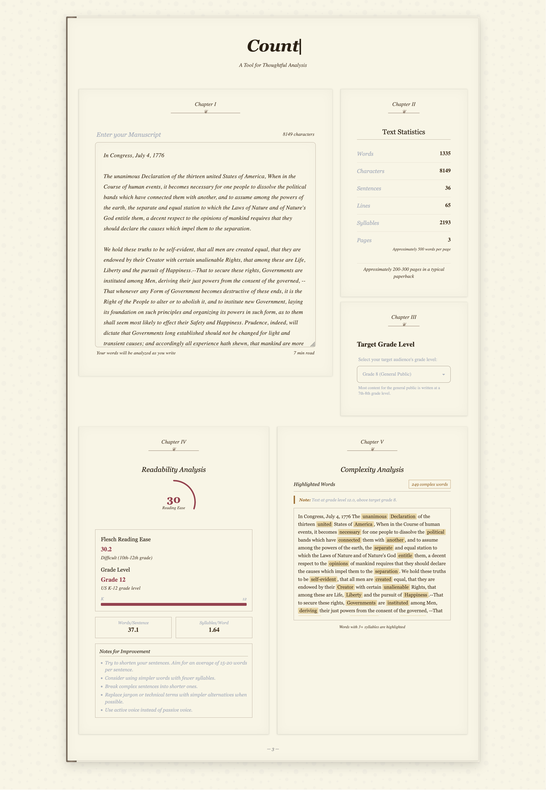

# Count - The Reader's Companion

Count is an elegant text analysis tool designed with a paperback book aesthetic. It helps writers and editors analyze text readability, complexity, and structure to ensure content is accessible to the intended audience.



## Features

### Text Analysis
- Word, character, sentence, line, syllable, and page counts
- Estimated reading time and paperback page equivalent

### Readability Analysis
- Flesch Reading Ease score calculation
- Flesch-Kincaid Grade Level assessment (K-12)
- Visual grade level indicator with color-coded feedback
- Average words per sentence and syllables per word metrics

### Complex Word Identification
- Highlights words with 3+ syllables that may impact readability
- Counts and displays complex words with hover tooltips
- Scrollable text view with preserved formatting

### Target Audience Customization
- Set target grade level (K-12) for your content
- Receive alerts when content exceeds target reading level
- Get specific improvement suggestions based on analysis

### Beautiful Book-Inspired Design
- Paperback book aesthetic with chapter markers
- Elegant typography with serif fonts
- Page number indicator that updates based on content length
- Reading progress indicator at the top of the page

## Getting Started

### Prerequisites
- Node.js (v14+)
- npm or bun

### Installation

1. Clone the repository:
```bash
git clone https://github.com/yourusername/count.git
cd count
```

2. Install dependencies:
```bash
npm install
# or
bun install
```

3. Start the development server:
```bash
npm run dev
# or
bun run dev
```

4. Open your browser and navigate to `http://localhost:3000`

## Usage

1. Enter or paste your text in the main text area (Chapter I)
2. View real-time statistics in Chapter II
3. Set your target audience grade level in Chapter III
4. Analyze readability metrics in Chapter IV
5. Review complex words and suggestions in Chapter V

## Built With

- [React](https://reactjs.org/) - UI framework
- [TypeScript](https://www.typescriptlang.org/) - Type safety
- [Tailwind CSS](https://tailwindcss.com/) - Styling
- [DaisyUI](https://daisyui.com/) - UI components
- [Vite](https://vitejs.dev/) - Build tool
- [Syllable](https://github.com/words/syllable) - Syllable counting

## Acknowledgments

- Cursor IDE
- Flesch-Kincaid readability research
- Classic book design principles
- Modern web typography practices